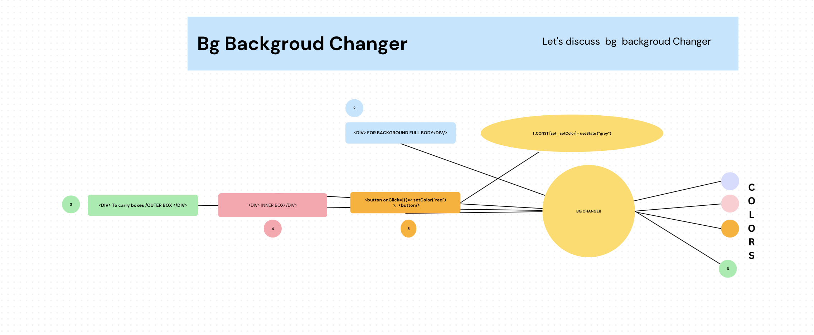

# My 15-Day React Journey
Welcome to my 15-day React journey repository! 🚀

Overview

In this repository, I document my learning experience with React over the course of 15 days. As a beginner in React, I embarked on this journey to understand the fundamentals, explore best practices, and build practical projects to solidify my knowledge

What's Inside

.Daily Progress: Each day is a new chapter in my learning journey. I've documented the concepts I covered, challenges faced, and the code I wrote each day.

.Projects: I've included the projects I worked on during this period. From simple components to more complex applications, these projects showcase the evolution of my React skills.

.Resources: Find a curated list of resources that helped me along the way. Whether it's tutorials, articles, or documentation, these resources can be valuable for fellow React enthusiasts.


# Day 1

## 1. Read React documentation and related resources

<a href="https://react.dev/" target="_blank">React documentation</a>


## 2. How To Start Your First Projects 

Read the article to know how to Start Your  Journey !!!
 
<a href="https://react.dev/learn/start-a-new-react-project" target="_blank"> Start React Journey </a>


## 3. Step 1: Create a GitHub Repository :
 To put your project up on GitHub, you will need to create a repository for it to live in.

<a href="https://docs.github.com/en/get-started/quickstart/create-a-repo" target="_blank">How To Create GitHub Repository </a>


##  Git commands for initializing a repository : 
 ````
     
  git init
  git add README.md
  git commit -m "first commit"
  git branch -M main
  git remote add origin https://github.com/granthverma/15-Days-React-Journey.git
  git push -u origin main


 ````

## 4. Understanding the Basics


Certainly! Before you start creating a React app, there are some basic things !!!! :


1. React's Dual Realm:
a : Unleashing Power on the Web with React DOM  💻 


b : Crafting Mobile Magic with React Native 📲 📲


2. Managing Packages and Executing Commands for Seamless Development

## a.Node Package Manager (npm): 

 npm comes bundled with Node.js, a JavaScript runtime. It serves as a package manager for JavaScript, allowing developers to easily install, share, and manage dependencies. Whether you're building a web application, a server-side application, or even a command-line tool, npm is an indispensable tool in your JavaScript toolkit 🏗️

## b. Executing Packages with Ease (npx) :
 
" npx" is a package runner tool that comes bundled with npm (Node Package Manager). It was introduced to address the challenge of running packages without installing them globally. Instead of cluttering your global npm space with packages you might only use occasionally, "npx" allows you to run packages directly.
    
## 5. Set up a simple React project using Create React App (CRA).🚀 

1.  Install Node.js and npm 💻:
    Make sure you have Node.js and npm installed on your machine. You can download them from the official website:<a href="https://nodejs.org/en/" target="_blank">Node.js.</a> 

 2. Check Your Node Version :
    Open your terminal or command prompt and run the following command to check your node version :

    ````
    node -v


    ````
 3.  Create a New React App:
     Now can create a new React app by running the following command:

     ````
      npx create-react-app my-first-react-app (name of your app)
     ````

4.  Navigate to Your Project Directory:

     ````
       cd my-first-react-app

     ````

5. Start the Development Server:
   Start the development server with the following command:

   ````
    npm run start
     ````

This command will start the development server and open your new React app in your default web browser. You should see a sample React app with a "Welcome to React" message.

Now you have successfully launched your first React project! You can start editing the files in the "src" directory to build your React components and customize your application.


## 6 . Understanding React Scripts in package.json

When you scaffold a new React project using tools like create-react-app, you'll notice a set of predefined scripts in the package.json file. These scripts are integral to managing and running various aspects of your React application.


1. "start"

   The "start" script is your go-to command during the development phase. When you run npm start in the terminal, this script kicks off the development server, allowing you to preview your React application in the browser. It enables hot-reloading, meaning any changes you make to your code will instantly reflect in the browser without requiring a manual refresh.

   ```
       "start": "react-scripts start",
   ```

 2. "build"
    
    As your React application progresses and you prepare to deploy it to a production environment, the "build" script comes into play. Executing npm run build triggers this script, which generates a production-ready build of your application. This build is optimized for performance, and the output is typically a set of static files that can be easily served by a web server.

  ```
      "build": "react-scripts build"
       
   ```

 3. "test"

    Testing is a crucial aspect of any software development process, and the "test" script facilitates running your application's test suite. Executing npm test launches the test runner, allowing you to verify that your components and functions behave as expected. This script is especially valuable in maintaining the reliability and integrity of your codebase.

  ```

    "test": "react-scripts test"
   
   ```
    

 4. "eject"

   While React strives to provide a streamlined and opinionated development experience, there may be instances where you need more control over your project configuration. The "eject" script allows you to "eject" from the default configuration provided by create-react-app, exposing all the configuration files (such as webpack and Babel) so you can customize them according to your needs.

  ```

   "eject": "react-scripts eject"

 ```

 Important Note: Ejecting is a one-way operation, so it's advisable to use this script with caution and understand the implications.


In conclusion, these scripts in the "scripts" section of your package.json file serve as powerful tools for developing, testing, building, and customizing your React application. By leveraging these scripts effectively, you can streamline your development workflow and ensure a smooth deployment process.


***Important Command *** 


1. cd .:
```
cd: Change directory command.

.: Refers to the current director

```

So, cd . essentially means "change to the current directory," which is a no-op (no operation) as you are already in that directory.

2.ls:

```
 ls 
 ls: List the contents of the current directory.

 after ls  package.json must visible to start

```


### Congratulations ✨ Your First React App


# VITE 

Now Days We Use Vite Beacause Fast compilation less Time Compare To React-create -app


### Getting Started Vite || Read Vite documentation 


<a href="https://vitejs.dev/guide/" target="_blank">  Getting Started Vite </a>

 ## Start Your First Vite Project

1. First Step

```
npm create vite@latest

```

2. Second Step 👣 👣.

Project Name :  Whatever You Want Your Project Name

```
? Project name: › vite-project

my-first-project

```

3. Third Step 👣 👣.

Select a framework:  Drop Down The 

```

    Vanilla
    Vue
    React
    Preact
    Lit
    Svelte
    Solid
    Qwik
    Others


    Select React


```
4. Fourth Step 👣 👣.

Select a variant: › - Use arrow-keys. Return to submit.
        


```
 TypeScript
    TypeScript + SWC
    JavaScript
    JavaScript + SWC


    Select JavaScript

```

##  Here are the steps to run a Vite app

1. Open your terminal or command prompt.

2. Change the directory to "01vitebasic":

```
 cd 01vitebasic

 //Refers to the current director


 README.md       index.html      package.json    public          src             vite.config.js

 // make sure package.json  is present

```

3.Install the necessary dependencies using npm:

```
npm install


// node modules is missing to install missing package run this command


```


4. Start the development server with the following command:

```
  npm run dev
 

```


### Congratulations ✨ Your First Vite App

> Important Notes :clean the defults Scr files and code


## Day 2  Understand The React & Vite Flow And Structure 
 
 
### File Structure in React

1. Pubilc Folder : index.html , images 


a1. index.html file : it just normal html file  , single page application

```
 <noscript>You need to enable JavaScript to run this app.</noscript>

 // its basically  means that if a user has JavaScript disabled in their browser, they will see the message "You need to enable JavaScript to run this app."
 <div id="root"></div>  

 // id name its depend on you whatever name you want !!!


```
> This is the entry point of your React application, and it's the place where the virtual DOM is attached to the actual DOM, allowing React to manage the UI updates efficiently. The root element is typically defined in the ReactDOM.render() function call in your JavaScript code

b1. manifest.json : The manifest.json file is a standard file used in web development to provide metadata and configuration details about a web application. It is commonly associated with Progressive Web Apps (PWAs) and is used to define various properties such as the application's name, icons, theme colors, and other settings.


c1. robots.txt : The robots.txt file is a text file placed on a website's server to provide instructions to web crawlers or robots about how to interact with the site's pages. It's a part of the Robots Exclusion Standard and is used to control which areas of a site should be crawled or not crawled by search engines and other web robots


2. Other files : 

2a. .gitignore:  a .gitignore file to specify files and directories that should be ignored by Git, preventing them from being tracked in your version control system. Here's a basic example of a .gitignore file for a typical React project:


2b. package-lock.json: In a React project (or any Node.js project), the package-lock.json file is automatically generated and maintained by the Node Package Manager (npm) or Yarn. It serves a crucial role in ensuring the consistency of installed packages across different environments and during different installations.


3c.  package.json :The package.json file is a metadata file for a Node.js project, and it is used to manage the project's dependencies, scripts, and other configurations. In a React project, the package.json file is a key component for managing the project's dependencies, scripts, and various settings.

4d. Readme.md : The README.md file typically serves as the primary documentation for your project, providing information about its purpose, how to set it up, how to use it, and any other relevant details for developers or contributors


3. Now we talk about src files :


3a. App.js : the App.js file is often a central component where the main structure of your application is defined. This is where you might organize and compose other components to build the overall structure of your user interface.

Here is a simple example of what an App.js file in a React project might look like:

```

// Import necessary modules and components
import React from 'react';
import Header from './components/Header';
import MainContent from './components/MainContent';
import Footer from './components/Footer';

// Define the App component
// 
function App() {
  return (
    // JSX representing the structure of your application
    <div className="App">
      <Header />
      <MainContent />
      <Footer />
    </div>
  );
}

// Export the App component for use in other parts of the application
export default App;


```


3b.index.js : the index.js file is typically the entry point for rendering your React application into the HTML page. It is used to import the main React component and render it into the DOM. The ReactDOM.render function is commonly used for this purpose.

(name kuch bhi ho skata hai )


Here is a basic example of what an index.js file might look like in a React project:

```

// Import necessary modules
import React from 'react';
import ReactDOM from 'react-dom';
import App from './App'; // Assuming App is your main React component
import './index.css'; // Optionally, import styles

// Render the App component into the root element in the HTML

const root = ReactDOM.createRoot(document.getElementById('root'));
root.render(
  
    
    <App />
    
   

);

//const root = name of  fnf
//ReactDOM = react dom its virtual dom of react (tree structure)
//createRoot = create a root 
// document.getElementById = selected the id 
// root.render = render the root 


```


### Create Component In React : 

1. Functional Components: 

```

// function name  start with capital letter
function Hero() {

    return(

        <> //fragment components  its only one component beacause we use 
     
         <h2> Second Components</h2>
         
         <p>  Components are the building blocks of a React application,
             and they can be thought of as reusable, independent pieces of code 
            that encapsulate a specific functionality or UI element.</p>


            <p>

          some imporant rule must you follow   
                1. file name start with capital letter  its for good  coding practice
                2. function name start with capital letter 
                3. when you create a function first letter must in capital letter
                4. export fnf ,default Name 
                5. import in app js 
                6  call in fnf name 
                7. fragment components
                
            </p>
        </>
       

      
    )
    
}


export default Hero 


// export for import in app.js its main componets 

```

### Vite Flow And Structure :

> mostly some as react, there some files we discuss are following:  


1 .  index.html :  Some as react major diffence is script file direct load in index.html


```
 <body>
    <div id="root"></div>

  <!-- The root div where your React app will be mounted -->

   <script type="module" src="/src/main.jsx"></script>

<!-- The script tag importing your main JavaScript module -->

  </body>

```

1a .there is script file is not loading thats why we use script direct in html file

```
"dependencies": {
    "react": "^18.2.0",
    "react-dom": "^18.2.0"
  },
<!--  there is script file is not loading thats why we use script direct in html file  -->


```

2 . main.jsx :the main.jsx file serves as the entry point for your application. This file is responsible for rendering the root component of your React app into the DOM. It is often the file specified in the src attribute of the script tag in your HTML file.


```
import React from 'react'
import ReactDOM from 'react-dom/client'
import App from './App.jsx'
import './index.css'

// Render the root component into the root element in the HTML 
// major differnce direct work not holding any root elements 


ReactDOM.createRoot(document.getElementById('root')).render(
  <React.StrictMode>
    <App />
  </React.StrictMode>,
)

// .render direct render file 
```

3  App.jsx :App.jsx file as part of your React project, it would typically contain the definition of your main App component. 

```
import { useState } from 'react'
import Zero from './Zero' //Zero is another component 


function App() {
  const [count, setCount] = useState(0)

  return (
    <>

<h1> Hello Nameste , its My first Vite  React App ✨ </h1>
<h2>  Chai☕️ aur React 💻 || By Hitesh Sir 👨🏻‍🏫 </h2>

<Zero/> // called the compontent ,Other components and content can be added 
    </>
    
     
        
    
  )
}

export default App


```


### Create Component In Vite :

  some as react only file name change .js  to.jsx 


1. file name start with Capital letter ex - Zero.jsx
2. function name also start with capital letter ex - Zero
3. if use more one things in zero file use fragment components because they allow only one compontes
4. export  default zero  when export then you able to import components in main app files 
5. import zero compontes in App.jsx
6. called the compontent in App.jsx file ,Other components and content according to your projects 


```
function Zero(params) {

    return (

        <h1>this is second compontent in jsx </h1>
    )
    
}


export default Zero

```


### second compontent in vite 


## Day 3 || Create your own react library and JSX


1.Create a folder (Customreact)

a1.Create two file - index.html and CustomReact.js 


2.Now we talk about index.html


```
<body>
    <div id="root"></div> 
    <!-- name depend on you  -->
 <script src="Customreact.js"></script>
 <!-- create custome js file its directly script come  -->

</body>


```

<div> with the id "root." Additionally, you are including a custom JavaScript file named "Customreact.js" using the <script> tag.


3.CustomReact.js ; in this file we talk about how to create elements and render the files
                    we discuss 2 approach a: basic approach , b: loop approach

                
> all short-notes in code file in hindi for better understanding


```

// basic approach 

function ownRender(reactElements ,thridcontainer) {

// render two things what (kya )aur  where (kha )
// what (kya) -reactElements
// where (kha) -thridcontainer


    // const domELe = document.createElement(reactElements.type)
    // domELe.innerHTML =reactElements.children

    /**
     * 1. store value  in domELe
     * 2. create element in reactElements and type of element
     * 3. access the value by domELe innerHTML  in reactElements ki children value
     */

//     domELe.setAttribute('href' ,reactElements.props.href)
//     domELe.setAttribute('target' ,reactElements.props.target)

//     thridcontainer.appendChild(domELe)
// 


//  by loop -------------

const  domELe =document.createElement(reactElements.type)
domELe.innerHTML = reactElements.children

/**
 * same as direct 
 */
for (const prop in reactElements.props ) {
    if(prop === 'children')continue;
    domELe.setAttribute(prop ,reactElements.props[prop])
    
}

thridcontainer.appendChild(domELe)


}

/**
 * for in loop liya then prop in mein reactElements.props define kiya
 * old mein pahale check karne ke liya  if use kiya karte tha
 * aur check karte tha ki prop agar equal hai child property ki continue karo
 * nahi toh stop kar do 
 * same hai bas name change pahle direact name tha now us hai prop bol rha hai 
 * then [] arry props likha raha hai 
 */


 /**
     * 1. jo element create kiya tha us mein attribute set karna 
     * 2. aue reactElements ki propety ko lena
     * 3. then value get kar thrid container mein appendchild se
     */


const reactElements = {
    type: 'A',
    props :{
        href :'https://granthcodes.com/',
        target : '_blank'
    },
    children: 'Click me to  visit portfolio'
}

/**
 * phale ek element create karo object hai jo ki type set karo imp baat
 * type mein only single value store kar saket ho
 * then whatever property you want us set kar do
 * 
 * what want you show on web in come with child 
 */

const secondContainer = document.querySelector('#root')

ownRender(reactElements ,secondContainer)


/**
 * jaise react mein hota root kaise value store hota hai yha par secondContainer
 * mein store hai aur document ki query selector se root ko select kiya hai 
 * 
 * own render jo create kiya tha wo hai 
 * us mein reactElements - jaise mein sare element hai 
 * secondContainer - jaise mein value store ki hai 
 */


```


### Deep UnderStanding main.jsx and app.jsx


1. In App.jsx we create method so we can create own methods in main.jsx
1a. we directly call fnf but we don't use it not good practice thats why 
    we use <MyApp/> , MyApp()

```
function MyApp() {

  return( 
    <div>
      <h1>Custom App ||| ✨</h1>
    </div>
  )
  
}
 

ReactDOM.createRoot(document.getElementById('root')).render(
  
   

    // MyApp()  fnf hai toh run kiya ja sakate hai but don't follow 
  
)
```

2. tree structure (object ) inject :

its not 

```


// const reactElements = {
//   type: 'A',
//   props :{
//       href :'https://granthcodes.com/',
//       target : '_blank'
//   },
//   children: 'Click me to  visit portfolio'
// }

//direct ho  raha toh pass karte hai , nahi hoga because to ye object hai

```
2a. systax is not right and  we must react rules 


2b . its right way to create the element 

```

const anElement = (
  <a href='https://google.com' target='_blank'> vist gooogle </a>
)

```

3 Evaluate  Expression : We Evaluate value  thriduser in reactelement by using Expression {} 
3a . only final value be pass in this n most don't use any loops
3b we React.createElement method create element , react bible inject them

```
const thriduser = "himanshu ji"

const reactelement = React.createElement(
  'a',
  {href: 'https://google.com' , target: 'blank'}, // target element 
  'click me to visit google by react element', // child
  thriduser //Evaluate  Expression
)


////


ReactDOM.createRoot(document.getElementById('root')).render(
  
    

     reactelement

    
  
)

```


## REACT BEHIND THE SCENES :


<a href="https://github.com/facebook/react/" target="_blank">REACT BEHIND THE SCENES || GITHUB REPO </a> 


## Day 4 || Hello Dosto Day start with Error ❗️❗️❗️❗️❗️


```
 ! [rejected]        main -> main (non-fast-forward)
error: failed to push some refs to 'https://github.com/granthverma/15-Days-React-Journey.git'

```

Kya kare ab Hum ❓❓❓❓❓❓


Pura Internet Par 2 hours invest kar ke baad Solution mile gaya ||
May be Aapko bhi Kaam aa jaye ✅ ✅ ✅...

1.first Step 👣

```
git fetch origin main:tmp

```

1. main:tmp: This part specifies that you want to fetch the changes for the remote main branch and store them locally in a branch named tmp. The format is source:destination, where source is the remote branch, and destination is the local branch where you want to store the changes.


2.Second Step 👣 : So, the command is saying: "Push the changes from my local branch tmp to the remote repository (origin).

```
git push origin tmp

```


3.Third Step 👣 👣 👣 : 

```
git rebase tmp

```

The command git rebase tmp is used to rebase your current branch onto the tmp branch. This means that the commits in your current branch will be moved to the tip of the tmp branch, effectively incorporating the changes from tmp into your branch.


4. Fourth Step :  Congratulations You Solve This Issue  ✨ ✨ ✨

```

git push

```


### Second Issue :   Github contribution only show the activity when we make a new repository ,  commit inside github ????????  

kafi dino se main commit vs code terminal mein karta but git ke contribution mein kuch show nahi hota ye kafi bada issue ho gaya mera liya toh kya kiya jaya   ❓❓❓❓❓❓ 


karna chahiye to kya nahi hota hai toh Internet ki help se hum laga es issue solve karna mein toh solution yha raha 

first step :  Go to into Your github Settings


1. check your email (only one email allow  granth@gmail.com)
2.then next step  check : To verify that the configuration has been set correctly, you can use the same git config user.email command as before.


```
git config user.email


```

This will output the email address currently associated with your Git commits.


3 .Configure or Change Email Address: If you need to configure or change the email address, use:

```
git config --global user.email "your.email@example.com"


```

Replace "your.email@example.com" with the email address you want to use for your Git commits. The --global option sets this configuration globally for your user, so it will be used for all your Git repositories. If you want to set it only for a specific repository, omit the --global option and run the command within the repository


4. Verify Configuration: To verify that the configuration has been set correctly, you can use the same git config user.email command as before.

```
git config user.email

```
It should now display the updated email address.

### Note:

The email address you configure in Git should match the email address associated with your GitHub or GitLab account if you want your contributions to be linked to your account on those platforms. It's important to use the same email address for your commits that you use on the version control hosting service to ensure proper attribution.

# HOOKS | useState(0) 

basic hooks are following :

1: useState: useState is used to add state to functional components. It returns an array with two elements: the current state value and a function that lets you update it.

## Counter App Project with Assignments 


```
import { useState } from 'react'
import reactLogo from './assets/react.svg'
import viteLogo from '/vite.svg'
import './App.css'

function App() {
  let [counter, setCounter] = useState(0)
// set value of counter  useState koi bhi value defaluts value
//two value  first - count
// setcount Second - its fnf is variable updated karne ke liya  man lo yhi main source hai 
  // let helpful hai counter app ke liya 


  const addValue = () => {
    if (counter <100) {
      counter =  counter+1
      setCounter(counter)

      
    } else {
      alert("You've reached the maximum value (100)!");
      
    }
// add value concept easy hai only function lena callback name kuch bhi ho sakta hai 
// assignment mile tha value 100 tk (20 tha but 100 le liya ) ek loop lekar  counter< 100 se ho jaya 
// ek add on alert bhi le liya  value reach then alert message 
  } ;


  const removeValue = () => {

    if (counter > 0) {
      counter =  counter-1
    setCounter(counter)
      
    }  else {
      alert("You've reached the minimum value (0)!");
      
    }
    

    
  } ;

  // some concept like add on 

  
  const ResetValue = () => {
    
    counter = 0 ;
    setCounter(counter)
    
  };
// reset value  counter = 0 le li  now reset hota hai zero aa jayegi 
  return (
    <>
      
      <h1>The-Counter</h1>
      <h2>Counter Value :{counter} </h2>
      <h3> The Counter count the value  0 to 100</h3>


      <button onClick={addValue}>Increment </button>
      
     <button onClick={removeValue}>decrement</button>
      
        
<br/>
      <button onClick={ResetValue}> Reset Value</button> 
    </>
  )
}


// hooks is updated hoga data  , import { useState } from 'react' yhi se aata hooks 

export default App


```

### DAY5 || START DAY-5 WITH READ ABOUT OTHER HOOKS

<a href="https://react.dev/reference/react/hooks" target="_blank"> Read More About Hooks </a>

its not part hitesh sir playlist but we read it some basic are following:


2. useEffect : useEffect is used to perform side effects in your components, such as fetching data, subscribing to services, or manually changing the DOM.


```
import React, { useState, useEffect } from 'react';

const DataFetchingComponent = () => {
  const [data, setData] = useState(null);

  useEffect(() => {
    // Perform side effect (e.g., data fetching) here
    const fetchData = async () => {
      const response = await fetch('https://api.example.com/data');
      const result = await response.json();
      setData(result);
    };

    fetchData();
  }, []); // Empty dependency array means the effect runs once after the initial render

  return (
    <div>
      <p>Data: {data}</p>
    </div>
  );
};


```

3. useContext: useContext is used to consume values from a React context.
```

import React, { useContext } from 'react';

const MyContext = React.createContext();

const ComponentUsingContext = () => {
  const contextValue = useContext(MyContext);

  return (
    <div>
      <p>Value from context: {contextValue}</p>
    </div>
  );
};


```

4. useReducer: useReducer is a hook that is usually preferable to useState when you have complex state logic.
```

import React, { useReducer } from 'react';

const initialState = { count: 0 };

const reducer = (state, action) => {
  switch (action.type) {
    case 'increment':
      return { count: state.count + 1 };
    default:
      return state;
  }
};

const CounterWithReducer = () => {
  const [state, dispatch] = useReducer(reducer, initialState);

  return (
    <div>
      <p>Count: {state.count}</p>
      <button onClick={() => dispatch({ type: 'increment' })}>Increment</button>
    </div>
  );
};


```

### Virtual Dom And Fiber Reconcillion :

Documentation Dom Fiber  and Reconcillion 👉🏻 👉🏻 👉🏻 👉🏻 👉🏻 
<a href="https://github.com/acdlite/react-fiber-architecture" target="_blank">Virtual Dom Fiber And Reconcillion</a> 

some basic things from  documentation

### Reconciliation is the algorithm behind what is popularly understood as the "virtual DOM."


lets talk about  Reconcillion :The algorithm React uses to diff one tree with another to determine which parts need to be changed.

2:A change in the data used to render a React app. Usually the result of `setState`. Eventually results in a re-render.


The key points are:

1.In a UI, it's not necessary for every update to be applied immediately; in fact, doing so can be wasteful, causing frames to drop and degrading the user experience.

2.Different types of updates have different priorities — an animation update needs to complete more quickly than, say, an update from a data store.

3.A push-based approach requires the app (you, the programmer) to decide how to schedule work. A pull-based approach allows the framework (React) to be smart and make those decisions for you.


> Important Points :
Different component types are assumed to generate substantially different trees. React will not attempt to diff them, but rather replace the old tree completely.

Diffing of lists is performed using keys. Keys should be "stable, predictable, and unique."


### Some basic points about Fiber from Documentation :

 
1.We're about to discuss the heart of React Fiber's architecture.

2.We've established that a primary goal of Fiber is to enable React to take advantage of scheduling. Specifically, we need to be able to.

-pause work and come back to it later.
-assign priority to different types of work.
-reuse previously completed work.
-abort work if it's no longer needed.

makedown comment future refencence


### Day 6 - TailWind And Props In React-js :


<a href="https://tailwindcss.com/docs/installation" target="_blank">Documentation TailWind Css || Get Started </a> 


For Vite Framework TailWind Css  Guides : <a href="https://tailwindcss.com/docs/guides/vite" target="_blank">Install Tailwind CSS with Vite</a> 

1st step : Install Tailwind CSS : Install tailwindcss and its peer dependencies, then generate your tailwind.config.js and postcss.config.js files.


```
npm install -D tailwindcss postcss autoprefixer
npx tailwindcss init -p
// generate new tailwind config files

```

2st step : Add the paths to all of your template files in your tailwind.config.js file.


```
content: [
    "./index.html",
    "./src/**/*.{js,ts,jsx,tsx}",
  ],


```

3rd : Add the Tailwind directives to your CSS

Add the @tailwind directives for each of Tailwind’s layers to your ./src/index.css file.

```
@tailwind base;
@tailwind components;
@tailwind utilities;

```

4th : Start your build process 
Run your build process with npm run dev.


```
npm run dev

```

5th : Start using Tailwind in your project

Start using Tailwind’s utility classes to style your content

```
<h1 className="text-3xl font-bold underline">
      Hello world!
    </h1>

```

Learn About How to Create Components :

Before Start There Some  Website Its Help Build  Various Types Of Components and UI-- 


1. <a href="https://www.devui.io/components/cards" target="_blank"> Dev.io </a>

2. <a href="https://mui.com/material-ui/" target="_blank"> Material.io </a>


3. <a href="https://github.com/granthverma/15-Days-React-Journey#create-component-in-react-" target="_blank"> We discussed earlier how to create Components  </a>

4. Important points :
a. rfc use for create second component files
b. img tags must be </> 
c. in react we use jsx so there class its keyword    we don't class , so we className to define class


### props || props Stand for Properties


Props :props (short for properties) is a mechanism for passing data from one component to another. Props allow you to customize and configure child components based on the data provided by their parent components. Here's a basic overview:

props are used to transfer data from one component to another ,props are read only ,props are just like a function in javascript , {} always use ,props facilitate the flow of data in a React application, enabling communication between components and allowing for greater flexibility and reusability.


1. Parent Component: one way used  props by  (props way) ,
In the parent component, you can pass data to a child component by adding attributes to the child component's JSX tag.

```
function Card(props) {}

    <h1 class="text-lg font-semibold text-white">{props.username}</h1>

```

2 .second  way used props by {direct}


```
function Card({username}) {}

    <h1 class="text-lg font-semibold text-white">{username}</h1>

```
3. Child Component:  In the child component, you can access the passed data through the props object.

```
<Card username="disha" btnText='click to more info' pText='my name is disha '/>

```

4 .Using Props: The child component can use the values passed through props in its rendering or logic.


5.Default Props: you can provide default values for props in case they are not passed by the parent.

```

<h1 class="text-lg font-semibold text-white">{username="Default Name" }</h1>

```


6.Children Prop: The children prop represents the content between the opening and closing tags of a component.

```

// ParentComponent.jsx
function ParentComponent() {
  return (
    <ChildComponent>
      <p>This is a child component's content.</p>
    </ChildComponent>
  );
}

// ChildComponent.jsx
function ChildComponent(props) {
  return (
    <div>
      <p>Child Component Content:</p>
      {props.children}
    </div>
  );
}


```

7. Prop Types: You can use prop types to specify the expected types for your props, which can help catch bugs and provide better documentation.


```
import PropTypes from 'prop-types';

function ChildComponent(props) {
  // component logic

  // Prop types
  ChildComponent.propTypes = {
    name: PropTypes.string,
    age: PropTypes.number,
  };

  return (
    // component JSX
  );
}


```
React Interview Question : can we use mutiple value
   <!-- setCounter(counter+1)
    setCounter(counter+1)
    setCounter(counter+1)
    setCounter(counter+1) -->


useState - value send in batch some = some hogi toh wosend nahi karga isliya hum  call back  ki help se prevCounter se value get kar lenge 


```
function App() {

  const [counter , setCounter] = useState(15)

  let counnter =15 

  <!-- const addValue = () => {
    setCounter(counter+1)
    setCounter(counter+1)
    setCounter(counter+1)
    setCounter(counter+1)
  } -->


   const addValue = () => {
    setCounter(prevCounter => prevCounter+1 )
     setCounter(prevCounter => prevCounter+1 )
      setCounter(prevCounter => prevCounter+1 )
       setCounter(prevCounter => prevCounter+1 )
    
  }


}

<!-- 19 -->
```


### Day 7  BG Changer Project 🎨 :
Basic of  step vite and tailwind


.lets Understand basic logic BG Changer Project 🎨 :
  



1:First Step 👣 : creating a state variable color with an initial value of "grey" and a function setColor that can be used to update the color state ypically, you would use this state variable in your React component to manage and update the color dynamically.


```
  const [color, setColor] = useState("grey")

```

2.Second Step 👣 👣 :  We use 3 Div class , first for whole body , second Div for outer body where we show ours button , thrid Div for inner body "Imporant note its not necessary  its only we  use for our projects  looks better 

```
<div>

<div> 
 <div> 
   <button> </button>
 
 </div>
</div>


 </div>

```


3.third Step 👣 👣 👣 : Take  buttons with onclick events and call back function  and use setColor for set colors : 

```
 <button onClick={()=> setColor("yellow")}> </button>
```
<a href="https://github.com/granthverma/15-Days-React-Journey/tree/main/04bgChanger" target="_blank"> Click to See Source code  BG Changer Project 🎨 </a>


### Day : 8 Password Generator Project ☠️☠️☠️:
Basic of step vite and tailwind


Lets Understanding Basic  Concpets :


**Stepoutthisproject**


1.import Statements: 
```
import { useState, useCallback, useEffect, useRef } from 'react'


```

These are import statements for hooks and features from the React library. You're using useState, useCallback, useEffect, and useRef in your component.


2.Function Component:

```
function App() {}

```
3.State Hooks: set to length ,number ,char, and password jha store hoga

```
const [length, setLength] = useState(8)
const [numberAllowed, setNumberAllowed] = useState(false);
const [charAllowed, setCharAllowed] = useState(false)
const [password, setPassword] = useState("")


```
These lines initialize state variables using the useState hook. length represents the password length

numberAllowed and charAllowed are boolean flags for including numbers and special characters in the password

and password holds the generated password

in simple word length of password , char aur number and password mein store hoga 


4 Password Generator Function:

```
const passwordGenerator = useCallback(() => {
 let pass = "" // password store 
let str = "ABCDEFGHIJKLMNOPQRSTUVWXYZabcdefghijklmnopqrstuvwxyz"
    if (numberAllowed) str += "0123456789"
    if (charAllowed) str += "!@#$%^&*-_+=[]{}~`"
 <!-- one loop kitne length hogi password
     for(let i =1 ; i<=length i++>){
      let char =Math.floor(Math.random()*str.length+1)
     }

     setPassword(pass)

     pass store setPassword mein 
 
  -->

}, [length, numberAllowed, charAllowed, setPassword])


```
This is a function named passwordGenerator created with useCallback. It generates a password based on the specified length and character types (uppercase, lowercase, numbers, and special characters).

5.
**Now-we-want-showinto labal**
for this we useEffect():
a.The useEffect Hook allows you to perform side effects in your components.
b.Some examples of side effects are: fetching data, directly updating the DOM, and timers.
c.useEffect accepts two arguments. The second argument is optional.
d.useEffect(<function>, <dependency>)


5.1.Effect Hook:

```
useEffect(() => {
  passwordGenerator()
}, [length, numberAllowed, charAllowed, passwordGenerator])

// es mein kuch change hoga then again run hoga program

```


This useEffect hook runs the passwordGenerator function whenever there's a change in length, numberAllowed, charAllowed, or password


6.
**useRef is a React Hook that lets you reference a value that’s not needed for rendering**

const ref = useRef(initialValue)

useRef ka use additional features ke liya hoga


```

passwordRef.current?.select();
//input field so that it can be easily copied to the clipboard.
    passwordRef.current?.setSelectionRange(0, 999);
// 0 to 999 value select hogi 


```

7.Copy Password to Clipboard Function:


```

const copyPasswordToClipboard = useCallback(() => {
  // ...
  window.navigator.clipboard.writeText(password)
}, [password])


```

This function, created with useCallback, selects and copies the generated password to the clipboard.


8.Return JSX: 

```
return (
  // all ui 
)


```


<a href="https://github.com/granthverma/15-Days-React-Journey/tree/main/05passwordGenerator" target="_blank"> Click to See Source code   Password GeneratorProject  </a>


### Day 9 || CurrencyConvertor 💵 💷 💸


<a href="https://github.com/granthverma/15-Days-React-Journey#vite" target="_blank"> Start Your Project with Vite basic </a>

<a href="https://github.com/granthverma/15-Days-React-Journey#day-6---tailwind-and-props-in-react-js-" target="_blank"> Next Step Tailwind config file for Project </a>


2.Next Step Create Own Hooks :How to create Hook ????-----

some basic point :
2.1. 🗂️ create a folder name of hooks
2.2. 👉🏻 create a file useCurrencyinfo name
2.3  👉🏻 hooks is function two things in first give you variable second give you variable const [data , Setdata]
2.4 👉🏻 when you create own hooks you can use pre build hooks like: useEffect() , useState() .. many more 
2.5 👉🏻 hooks method array mein two things return karta hai first variable , second function
2.6 👉🏻 .js isliya liya beacuse its pure js hai

3. UseCurrencyinfo. This component utilizes the useEffect and useState hooks to fetch currency information from an external API and manage the component's state.


```

import React, { useEffect, useState } from 'react';

function UseCurrencyinfo() {
  // Step 1: Initialize state using the useState hook , where data store
  const [data, setData] = useState({});

  // Step 2: Use the useEffect hook to fetch currency information 
  useEffect(() => {
    // Step 2a: Fetch data from an external API based on a dynamic currency value
    fetch(`https://cdn.jsdelivr.net/gh/fawazahmed0/currency-api@1/latest/currencies/${currency}.json`)
      .then((res) => res.json())
      .then((res) => setData(res[currency]));

    // Step 2b: Log the data (Note: This log may not reflect the updated state immediately)
    console.log(data);
  }, [currency]); // Step 3: Dependency array to re-run the effect when currency changes

  // Step 4: Log the data outside of the useEffect (may not be updated immediately)
  console.log(data);

  // Step 5: Return the data from the component
  return data;
}

// Step 6: Export the component
export default UseCurrencyinfo;


```


### Day 9 || ReactRouter 👨🏻‍💻 🔗🖇️


1. <a href="https://github.com/granthverma/15-Days-React-Journey#vite" target="_blank"> Start Your Project with Vite basic </a>

2. <a href="https://github.com/granthverma/15-Days-React-Journey#day-6---tailwind-and-props-in-react-js-" target="_blank"> Next Step Tailwind config file for Project </a>

3.  lets discuss about router : <a href="https://reactrouter.com/en/main/start/tutorial" target="_blank"> documentation of router </a>

what is react router : React Router is a React library that  enables dynamic navigation without refreshing the entire web page ,React Router is a library for handling routing in React applications. In a single-page application (SPA), where the entire application runs in the browser and only the content is updated dynamically, routing refers to the concept of navigating between different views or pages within the application without triggering a full page reload.


4. Installation ✅ ✅ : install react router dom

```
  cd project name 
 npm install react-router-dom

```
5. Import React Router Components  ✅ ✅ : include necessary elements from react-router-dom 


```
import { Link, NavLink } from "react-router-dom";

// import link Navlink  from "react-router-dom";

 import { useParams } from "react-router-dom";

<!-- useParams is a hook provided by React Router that allows you to access the parameters (or dynamic segments) from the current route's URL -->


```
6. Layout  ✅ ✅ : fixed page  example header and footer fixed (iske beech mein page reload ho jayaga)

```
import {Outlet} from 'react-router-dom'

<Header/>
<Outlet/> // outlet se fixed ho jata hai 
 <Footer/>


```

7. Set Up Routes ✅ ✅ ✅ ✅ :  Set Up Routes in main.jsx

```
<RouterProvider router={router}/>

// wrap

```
Simple Router Component BrowserRouter for Wrap Routes 

```
 const router = createBrowserRouter ([
//    {
//     path:'/',
//     element:<Layout/>,
//     children:[

//       {
//         path:'',
//         element:<Home/>
    
//     },

//     {
//       path:'About',
//       element:<About/>,
  
//   },

//   {
//     path:'Contact',
//     element:<Contact/>,

//    }
//     ]

//    }


// ]) 

```

Setup Routes 2 nd way


```

//createBrowserRouter
//createRoutesFromElements 
// <Route> </Route>

const router = createBrowserRouter (
  createRoutesFromElements(
    <Route path='/' element={<Layout/>} >
      <Route path ='' element={<Home/>} />
      <Route path ='About' element={<About/>} />
      <Route path ='Contact' element={<Contact/>} />
      <Route path ='user/:userid' element={<User/>} />
      <Route path ='Github' element={<Github/>} />

      <Route
      
       path ='Github'
       element={<Github/>} 
       />
    </Route>

  )
)

```


7. Navigation ✅ ✅ ✅ ✅ : <NavLink/> or </link>
  components for clickable route links

7a. <Link /> is a simple component used for navigation. It creates a hyperlink to the specified URL without any additional styling or attributes.

Example:

  ```
  
  import { Link } from 'react-router-dom';

  const Navigation = () => (
  <nav>
    <Link to="/">Home</Link>
    <Link to="/about">About</Link>
  </nav>
);

  
  ```

7b .NavLink /> is similar to <Link />, but it provides additional features for styling the active link based on the current route.
Example:
```
import { NavLink } from 'react-router-dom';

const Navigation = () => (
  <nav>
    <NavLink to="/" activeClassName="active">Home</NavLink>
    <NavLink to="/about" activeClassName="active">About</NavLink>
  </nav>
);


```
7c. activeClassName:It accepts a prop called activeClassName to specify the class to apply when the link is active ,It adds an active class to the link when its to route is active.


```
${
                                          isActive
                                            ? "text-orange"
                                            : "text-gray-700"
}

hai toh ?
nahi hai toh :
```


8. Import data from api :

```
const [data, setData] = useState([]);
  useEffect(() => {
    fetch("https://api.github.com/users/granthverma")
      .then((response) => response.json())
      .then((data) => {
        console.log(data);
        setData(data);
      });
  }, []);


```

Get to data :.value you want 


```

return (
    <div className="bg-orange-500 text-white text-3xl p-12  text-center flex flex-wrap">
     
     
      
      Github UserName :{data.login} <br/>
      Name :{data.name}  <br/>
      Location :{data.location} <br/>
    </div>
  );


```

9. useParams() :  is a hook provided by React Router that allows you to access the parameters (or dynamic segments) from the current route's URL. It's particularly useful when working with dynamic routes where certain parts of the URL can change, such as an ID or a slug.

1. Import the hook:you need to import useParams from the react-router-dom library.

```
import { useParams } from 'react-router-dom';

```
2. Use it in a component: Place the useParams() hook within a functional component that is a descendant of a Route component.

```

<Route path ='user/:userid' element={<User/>} />


import React from 'react';
import { useParams } from 'react-router-dom';

const UserProfile = () => {
  // Using useParams to get the 'username' parameter from the URL
  const { username } = useParams();

  return (
    <div>
      <h2>User Profile</h2>
      <p>Username: {username}</p>
    </div>
  );
};

export default UserProfile;


```
3. Dynamic Route Configuration: In your route configuration, use a dynamic parameter in the path attribute. This dynamic parameter is what useParams will extract

```

import { BrowserRouter as Router, Route } from 'react-router-dom';
import UserProfile from './UserProfile';

const App = () => {
  return (
    <Router>
      <Route path="/user/:username" component={UserProfile} />
    </Router>
  );
};

export default App;


```
In this example, the :username in the path of the Route indicates that this part of the URL is dynamic, and useParams will be able to extract it.

4. Accessing Parameters:The useParams() hook returns an object where the keys are the parameter names specified in the route, and the values are the corresponding values from the current URL.

```
const { parameterName } = useParams();


```
In the UserProfile component example above, const { username } = useParams(); extracts the username parameter from the URL.

Now, when you navigate to a URL like /user/john, the UserProfile component will receive the username as a parameter, and you can use it in your component logic.


### Day 10  ||  Context API 

1. <a href="https://github.com/granthverma/15-Days-React-Journey#vite" target="_blank"> Start Your Project with Vite basic </a>

> The Context API in React provides a way to share data or state across multiple components without passing it explicitly through props at every level of the component tree. It allows you to create a central store of data that can be accessed by any component within its subtree, streamlining the management of shared information in a React application.


The Context API is a part of React, a popular JavaScript library for building user interfaces. It provides a way to share values like props between components without having to pass the data through each level of the component tree explicitly. This can be especially useful when dealing with deeply nested components where passing props through every level can become cumbersome.

In React, components are typically structured in a tree-like hierarchy, and data is passed down from parent components to child components through props. However, when you have multiple levels of nesting, it can become tedious to pass data through every intermediate component.

The Context API helps to address this issue by allowing you to create a "context" that can be accessed by any component within its tree, regardless of how deeply nested they are. This context can store values such as state, functions, or any data you want to share.


1. <a href="https://react.dev/reference/react/useContext" target="_blank"> 
 Documentation Context Api</a>


### Here's a basic example of how the Context API works:
.

# H1
## H2
### H3 


**bold text**

*italicized text*


1. First item
2. Second item
3. Third item


- First item
- Second item
- Third item


`code`


	---


  

  [title](https://www.example.com)


  	Here's a sentence with a footnote. [^1]

[^1]: This is the footnote.


- [x] Write the press release
- [ ] Update the website
- [ ] Contact the media


