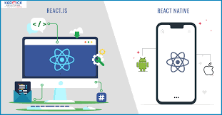

# My 15-Day React Journey
Welcome to my 15-day React journey repository! 🚀

Overview

In this repository, I document my learning experience with React over the course of 15 days. As a beginner in React, I embarked on this journey to understand the fundamentals, explore best practices, and build practical projects to solidify my knowledge

What's Inside

.Daily Progress: Each day is a new chapter in my learning journey. I've documented the concepts I covered, challenges faced, and the code I wrote each day.

.Projects: I've included the projects I worked on during this period. From simple components to more complex applications, these projects showcase the evolution of my React skills.

.Resources: Find a curated list of resources that helped me along the way. Whether it's tutorials, articles, or documentation, these resources can be valuable for fellow React enthusiasts.


# Day 1

##  Read React documentation and related resources

<a href="https://react.dev/" target="_blank">React documentation</a>


## how to start projects 

Read the article to know how to Start Your  Journey
 
<a href="https://react.dev/learn/start-a-new-react-project" target="_blank"> Start React Journey </a>

## Understanding the Basics


Certainly! Before you start creating a React app, there are some basic things !!!! :


1. React's Dual Realm:
a : Unleashing Power on the Web with React DOM  💻 
b : Crafting Mobile Magic with React Native 📲 📲





2. Managing Packages and Executing Commands for Seamless Development

## a.Node Package Manager (npm): 

 npm comes bundled with Node.js, a JavaScript runtime. It serves as a package manager for JavaScript, allowing developers to easily install, share, and manage dependencies. Whether you're building a web application, a server-side application, or even a command-line tool, npm is an indispensable tool in your JavaScript toolkit 🏗️

## b. Executing Packages with Ease (npx) :
 
" npx" is a package runner tool that comes bundled with npm (Node Package Manager). It was introduced to address the challenge of running packages without installing them globally. Instead of cluttering your global npm space with packages you might only use occasionally, "npx" allows you to run packages directly.
    


Set up a simple React project using Create React App (CRA).🚀 

1.  Install Node.js and npm 💻:
    Make sure you have Node.js and npm installed on your machine. You can download them from the official website:<a href="https://nodejs.org/en/" target="_blank">Node.js.</a> 

 2. Check Your Node Version :
    Open your terminal or command prompt and run the following command to check your node version :

    ````
    node -v


    ````
 3.  Create a New React App:
     Now can create a new React app by running the following command:

     ````
      npx create-react-app my-first-react-app (name of your app)
     ````

4.  Navigate to Your Project Directory:

     ````
       cd my-first-react-app

     ````

5. Start the Development Server:
   Start the development server with the following command:

   ````
    npm start
     ````

This command will start the development server and open your new React app in your default web browser. You should see a sample React app with a "Welcome to React" message.

Now you have successfully launched your first React project! You can start editing the files in the "src" directory to build your React components and customize your application.


